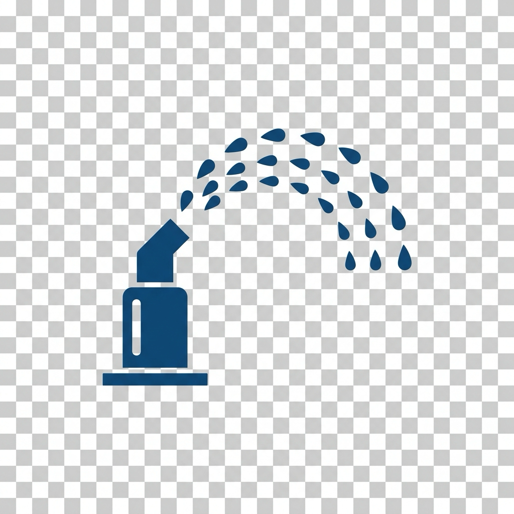

# ioBroker.irrigation

**Tests:** 

## irrigation adapter for ioBroker

Controls irrigation zones, valves and watering schedules based on sensors and weather data.

### Features
- Valve support for [Gardena](https://www.gardena.com/) (smartgarden), Homematic, [Rain Bird](https://www.rainbird.com/) and [Hydrawise](https://hydrawise.com/), plus generic ioBroker states, with auto-discovery via object-tree scanning
- Zones with configurable duration, weekday schedule, groups and rain/soil-moisture based skipping
- Plans that group zones for combined watering runs, with automatic parallel batching based on pump capacity
- Manual per-zone watering, independent of the automatic schedule
- Configurable timer schedule and iCal calendar trigger
- Optional legal watering restriction based on DWD weather data (heat-related bans)
- Optional weather API integration (OpenWeatherMap)
- Water consumption tracking and flow-based leak/clog detection with calibration
- Notifications via Pushover/Telegram
- Normal and expert configuration modes in the admin UI

### Known limitations
- Gardena auto-discovery skips valves whose name is still the Gardena default placeholder (e.g. "Valve 1", "Valve 2", ...), since these usually correspond to unused/unconnected outputs on the controller. Rename the valve in the Gardena app to something else if it should be discovered.

---

## User Manual

### Quick Start — Minimal Setup

The fastest way to get your irrigation running with just two steps:

1. **Add your valves** — Open the **Valves** tab, click **Scan for valves** to auto-discover connected valves (Gardena, Homematic, Rainbird, Hydrawise) or manually add a generic valve by entering its ioBroker state ID. A scan also refreshes names of already known valves from the source adapter's object tree.
2. **Set a schedule** — Open the **Control** tab, enable **Automatic mode** and add one or more timer times (e.g. `06:00` and `19:00`).

Save the configuration. The adapter will now water all zones on all days at the configured times. Every valve gets a default zone with a duration of 10 minutes.

---

### Configuration Tabs

The adapter configuration is organized into tabs. In **Normal mode** you see 5 tabs; enable **Expert mode** on the first tab to unlock additional settings.

#### Tab: General

| Setting | Description |
|---------|-------------|
| Expert mode | Shows advanced configuration tabs (Sensors, Weather API, Legal Restriction, Notifications) and adds expert-only columns to the Zones and Control tabs. |

---

#### Tab: Valves

A valve is the physical output that opens or closes a water circuit. Each valve must be configured before you can assign zones to it.

**Auto-Discovery (recommended):**
1. Select your valve type (Gardena, Homematic, Rainbird, Hydrawise, Generic, or All).
2. If prompted, select the corresponding ioBroker adapter instance.
3. Click **Scan for valves** — discovered valves are added to the table automatically.

**Manual Configuration:**
Add entries to the table directly:

| Column | Description |
|--------|-------------|
| Display name | A descriptive name for the valve (e.g. "Front lawn", "Hedge"). |
| Type | Valve type: **Gardena** (smartgarden), **Homematic**, **Rainbird**, **Hydrawise**, or **Generic** (any writable boolean state). |
| Target run duration (s) | How long the valve runs when started manually (in seconds, default 600 = 10 min). |
| State id | The ioBroker state ID that controls the valve. For Gardena this is `duration_value`; for Hydrawise it is the zone's `runZone` state, discovered automatically. |

The all-off state (a master stop that shuts down all valves on the same controller at once, e.g. Gardena's `stop_all_valves_i` or Rainbird's `stopIrrigation`) is detected and stored automatically by **Scan for valves** and is not shown as a column - it is applied internally when needed and does not require manual configuration.

**Hydrawise:** Install and configure `ioBroker.hydrawise` first. The Hydrawise scan finds every `schedule.<zone>.runZone` state, uses it to start a zone for the requested seconds, sends the associated `stopZone` command to stop it, and reads the zone's `time` state as remaining runtime.

- **Delete all valves** removes all entries with a confirmation prompt.

---

#### Tab: Zones

A zone represents one irrigation area and is linked to exactly one valve. Zones are where you define watering durations, weekday restrictions, and sensor dependencies.

| Column | Description |
|--------|-------------|
| Name | Zone name (e.g. "Lawn front", "Vegetable beds"). |
| Valve index | The index of the valve this zone controls (1 = first valve in the Valves table). |
| Duration (min) | Watering duration for automatic schedule runs. |
| Enabled | Enable or disable this zone globally. |
| Rain independent | Expert — if enabled, the zone runs even when the rain sensor is active. |
| Moisture threshold (%) | Expert — skip watering if soil moisture is at or above this percentage (0 = disabled). |
| Manual duration (min) | Expert — duration used when starting this zone manually. |
| Flow rate (l/min) | Expert — estimated water flow rate (used for batching and consumption calculation). |
| Groups (comma separated) | Expert — tags to assign the zone to specific plans (e.g. `Lawn`, `Beds`). |
| Weekdays (0=Sun..6=Sat) | Expert — restrict watering to specific days (e.g. `1,3,5` = Mon, Wed, Fri). Empty = all days. |

---

#### Tab: Plans

Plans group zones by tags for combined watering runs. When a plan is triggered, it waters all zones whose **Groups** match the plan's groups.

| Column | Description |
|--------|-------------|
| Name | Plan name (e.g. "Lawn plan", "Evening run"). |
| Groups | Comma-separated group names. Only zones that have at least one matching group are included. Leave empty to include all zones. |

The built-in default plan **"All"** (all zones) has empty groups and therefore always waters every enabled zone. Use the single **Plan name** field to enter a name, then select **Add new plan** or **Rename selected plan** and confirm the dialog. Plan names must be unique.

For sequential operation (`Pump capacity` = `0`), the valve order from the **Valves** tab is the execution order for every plan. The plan table only controls which valves are assigned; it cannot reorder them. With parallel batching enabled, valves are grouped by pump capacity and duration instead, so the configured global order is not guaranteed.

**Example:** Zone "Rasen vorne" has groups `Lawn`, Zone "Hecke" has groups `Hedge`, Zone "Beet" has groups `Beds,Lawn`. A plan with groups `Lawn` would water "Rasen vorne" and "Beet" but not "Hecke".

---

#### Tab: Control

Central scheduling and behavior settings.

**Normal mode:**

| Setting | Description |
|---------|-------------|
| Automatic mode enabled | Master switch for all automatic watering. When disabled, only manual starts are possible. |
| Pause automatic watering when raining | Requires a configured rain sensor. A running automatic plan pauses when rain is detected and resumes with its remaining durations when rain stops. Manual runs are unaffected. |
| Wind speed/gust state, Wind speed/gust limit (km/h), Wind resume hysteresis (min) | Expert. Numeric ioBroker states for wind speed and/or gust, and the km/h limit for each (0 disables that check). A running automatic plan pauses immediately once speed or gust reaches its limit, and only resumes once both have stayed below their limits continuously for the configured hysteresis time (avoids rapid pause/resume in gusty conditions). |
| Pause automatic watering when windy | Expert. Enables the wind/gust pause above. Requires at least one of the wind states to be configured. Manual runs are unaffected. |
| Timer times | One or more times in `HH:MM` format. At each time, the first plan in the Plans table is triggered. |
| Temperature state for irrigation adjustment | Numeric ioBroker temperature state in °C used for automatic plan duration adjustment. It must be selected before the adjustment can be enabled. |
| Temperature-controlled irrigation adjustment | Enables a factor fixed when each automatic plan starts: `1.07^(T - 20)`, where `T` is the selected temperature in °C. At 20 °C the factor is 1.00; each degree above increases duration by 7%, each degree below decreases it by 7%. The factor multiplies the configured duration extension factor and applies to all valves in that plan. Manual valve starts are not adjusted. |

**Expert mode:**

| Setting | Description |
|---------|-------------|
| Duration extension factor | Multiplier applied to all zone durations (0.5–5.0). Use 0.5 for half durations, 2.0 for double. |
| Pump capacity (l/min) | Maximum water output of your pump. When set > 0, zones are batched in parallel if their combined flow rate does not exceed this value. Set to 0 for purely sequential watering. |
| Pause between batches (min) | Waiting time between batch runs to allow water to soak in. |
| Season pause enabled | Pauses all automatic watering outside a defined season. |
| Season start / end month | The months (1–12) between which automatic watering is allowed. Supports wrap-around (e.g. Nov–Feb for winter pause). |
| Frost protection enabled | Blocks automatic watering when the temperature falls below the threshold. |
| Frost protection min. temperature (°C) | Temperature below which watering is skipped. Requires a temperature sensor to be configured. |
| iCal adapter instance | ioBroker iCal adapter instance for calendar-based scheduling. |
| iCal trigger state id | State that triggers a calendar lookup (set by iCal adapter when events start). |
| iCal event title prefix | Text that calendar events must start with to be recognized (default: "Bewässerung"). The part after the prefix (and optional colon/dash) is matched against plan names. |

**iCal Example:** A calendar event titled "Bewässerung: Rasen" triggers the plan named "Rasen". "Bewässerung - Beete" triggers the plan "Beete".

---

#### Tab: Sensors (Expert)

Connect external sensor states for weather-dependent watering decisions.

| Setting | Description |
|---------|-------------|
| Rain sensor state id | Boolean state (`true` = rain detected). When active, all zones are skipped except those marked **Rain independent**. |
| Soil moisture sensor state id | Number state (0–100%). Zones with a **Moisture threshold** above 0 are skipped if the sensor value exceeds their threshold. |
| Temperature sensor state id | Number state (°C). Used for frost protection (see Control tab). |

---

#### Tab: Weather API (Expert)

Integrates live weather data from OpenWeatherMap into ioBroker states.

| Setting | Description |
|---------|-------------|
| Weather API enabled | Enable/disable weather data polling. |
| API type | Currently only OpenWeatherMap is supported. |
| API key | Your OpenWeatherMap API key (stored encrypted). Free tier is sufficient for most use cases. |
| Latitude / Longitude | Geographic coordinates for the weather location. |
| Poll interval (min) | How often weather data is fetched (minimum 10 minutes recommended for free API tier). |

Weather data is published to these states: `weather.temperature`, `weather.precipitation`, `weather.precipitationChance`, `weather.lastUpdate`.

---

#### Tab: Legal Restriction (Expert)

In Germany, municipalities may impose watering bans during heat waves. This adapter can activate a watering restriction within a configured annual date range and daily time range. A restriction prevents automatic watering and pauses a running automatic program; it resumes automatically once the restriction is no longer active. Manual valve commands are unaffected.

| Setting | Description |
|---------|-------------|
| Legal restriction check enabled | Master switch for the complete restriction feature. When disabled, the restriction is always inactive. |
| DWD station | Select one DWD station by name. This is one possible temperature source. Selecting a DWD station clears the local temperature state. |
| Local temperature state | Select one numeric ioBroker state from the object tree. Its value in °C is used as the temperature source. Selecting a local state clears the DWD station. A local state has no DWD network request. |
| Restriction start/end date | Optional annual range in `D.M` format, e.g. `13.5` to `30.9`. Entering a start date enables the end date; clearing it disables and clears the end date. If no start date is entered, the date condition applies all year. Ranges may cross New Year, e.g. `15.11` to `15.2`. |
| Restriction start/end time | Optional daily range in `HH:MM` format, e.g. `15:10` to `18:00`. Entering a start time enables the end time; clearing it disables and clears the end time. If no start time is entered, the time condition applies all day. Ranges may cross midnight, e.g. `22:00` to `06:00`. |
| Maximum irrigation temperature (°C) | Active only with a DWD station or local temperature state. At or above this temperature, the restriction becomes active while the date and time conditions apply. |
| Check interval (min) | Polling interval for the configured temperature source and for evaluating date/time boundaries. A local temperature-state change is additionally evaluated immediately. |

### Restriction Decision Rules

1. **Date and time are independent:** the restriction can apply only when both configured ranges match. A start field enables its end field; leaving a start field empty removes only that condition.
2. **Temperature source is optional:** with a DWD station or local state, the restriction is active only when the temperature is at least the configured maximum irrigation temperature. With neither source selected, it is active throughout the matching date/time window, independent of temperature; the temperature field is disabled.
3. **Sources are mutually exclusive:** configuring a DWD station removes the local state and configuring a local state removes the DWD station. Only the selected source is read.
4. **Unavailable temperature values are safe:** if DWD data cannot be fetched or a configured local state has no valid numeric value, the adapter retains the previous restriction state rather than switching source or guessing a temperature.
5. **Examples:** with `13.5`–`30.9`, `15:10`–`18:00`, and `27 °C`, automatic watering is blocked only in that annual daily window when the selected source reports `27 °C` or more. With both date fields and both time fields empty, and no temperature source, automatic watering is blocked continuously while the master switch is enabled.

---

#### Tab: Notifications (Expert)

Receive alerts about adapter events via Pushover or Telegram.

| Setting | Description |
|---------|-------------|
| Pushover instance | ioBroker Pushover adapter instance for push notifications. |
| Telegram instance | ioBroker Telegram adapter instance for message notifications. |
| Water consumption tracking enabled | Records water usage per zone and aggregates (today, week, month, total). |

Notifications are sent for events such as: watering started/completed, leak detected, clog suspected, legal restriction activated.

---

### ioBroker Data Point Reference

All IDs below are relative to the adapter instance, e.g. `<instance>` is normally `irrigation.0`. **R** means read-only status; **R/W** means the state accepts commands or selections. For commands, write with `ack=false`; the adapter processes the command and confirms/reset it with `ack=true`.

#### `scan`

| ID | Type / access | Meaning and use |
|---|---|---|
| `scan.progress` | string, R | Progress and result text of an admin valve scan, e.g. `Found and added 2 new valve(s).` |

#### `automation`

| ID | Type / access | Meaning and use |
|---|---|---|
| `automation.active` | boolean, R/W | Enables automatic timer-based operation. A runtime write changes the current adapter session. |
| `automation.running` | boolean, R | `true` while an automatic plan or manual valve run is active or paused. |
| `automation.status` | string, R | Human-readable execution status including plan, batch, active valves and pauses. |
| `automation.start` | boolean button, R/W | Write `true` to start the first plan in the Plans table. Resets to `false`. |
| `automation.startPlan` | string command, R/W | Write a plan name to start that plan directly; selectable values are maintained from `plansList` and the state resets to an empty string. |
| `automation.stop` | boolean button, R/W | Write `true` to stop the current automatic or manual run. Resets to `false`. |
| `automation.pause` | boolean button, R/W | Write `true` to pause or resume the current automatic plan. Resets to `false`. |
| `automation.next` / `automation.back` | boolean buttons, R/W | Write `true` to skip the current batch or repeat the previous batch. Each resets to `false`. |
| `automation.currentValve` | number, R | Zero-based index of the first currently running valve; `-1` if none is running. |
| `automation.currentBatch` / `automation.totalBatches` | number, R | Current one-based batch number and total calculated batches; `currentBatch` is `0` while idle. |
| `automation.batchValves` | JSON string, R | Zero-based valve indexes in the active batch, e.g. `[0,2]`; `[]` while idle. |
| `automation.totalDuration` / `automation.elapsedTime` / `automation.remainingDuration` | number, seconds, R | Planned duration, elapsed wall-clock time and remaining duration of the current automatic run. All three reset to `0` when `automation.stop` is used. |
| `automation.remainingDurationMin` | string, R | Same value as `automation.remainingDuration`, formatted as `mm:ss` (or `hh:mm:ss`). |
| `automation.activePlan` | string, R | Name of the currently active plan; empty while idle. |
| `automation.planSelect` | string, R/W | Selectable plan-name value for external UIs. It is kept in sync with the available plans; use `startPlan` to execute a choice directly. |
| `automation.plansList` | JSON string, R | Available plan names, e.g. `["All","Rasen"]`. Use this to populate scripts or external UI selectors. |
| `automation.plansData` | JSON string, R | Internal persistent plan definition containing `name`, legacy indexes, and stable `valveStateIds`. The stable IDs keep assignments correct when valves are renamed, added, removed, or reindexed. Sequential order always follows the Valves tab. |
| `automation.extensionFactor` | number, R/W | Configured duration multiplier (`0.5` to `5`) mirrored from adapter settings. |
| `automation.temperatureAdjustmentEnabled` / `automation.temperatureAdjustmentStateId` | boolean / string, R/W | Enables temperature-controlled duration adjustment and identifies its numeric temperature source. |
| `automation.temperatureAdjustmentFactor` | number, R | Factor fixed at the start of the current automatic plan using `1.07^(T - 20)`; `1` when inactive or idle. |
| `automation.pumpCapacity` | number, `l/min`, R/W | Configured pump capacity used while building parallel batches. |
| `automation.valvePause` | number, `min`, R/W | Configured pause between batches. |
| `automation.seasonEnabled` / `automation.seasonStart` / `automation.seasonEnd` | boolean / number, R/W | Mirrored seasonal pause settings; months are `1` through `12`. |
| `automation.frostEnabled` / `automation.frostMinTemp` | boolean / number `°C`, R/W | Mirrored frost-protection settings. |

#### `valves.valve_NNN` (one channel per configured valve)

`NNN` is a zero-based, three-digit index, e.g. `valves.valve_000`. Configuration-derived states are mirrored at startup. Use `state`, `duration`, `manualStart`, and `manualDuration` for operational control; edit the adapter configuration for durable configuration changes.

| Suffix | Type / access | Meaning and use |
|---|---|---|
| `.name` | string, R/W | Display name of the valve. |
| `.type`, `.stateId`, `.allOffId` | string, R | Configured valve type, underlying adapter state, and optional Rainbird all-off command state. |
| `.state` | boolean, R/W | Direct valve control. Write `true` to run for `.duration` minutes; write `false` to stop. It also reports actual valve activity. |
| `.remainingDuration` | number, seconds, R | Remaining runtime of the valve. |
| `.remainingDurationMin` | string, R | Same value as `.remainingDuration`, formatted as `mm:ss` (or `hh:mm:ss`). |
| `.timestampStart` | number, Unix milliseconds, R | Start timestamp of the most recent/active valve run. |
| `.online` | boolean, R | Reachability indicator, initially `true`. |
| `.errorLast` | string, R | Most recent start or stop error; cleared after a successful start. |
| `.enabled` | boolean, R/W | Configured enabled flag used for automatic plans. |
| `.flowRateLpm` | number, `l/min`, R | Configured flow rate used for batching and water-consumption calculation. |
| `.duration` | number, `min`, R/W | Unified valve watering duration. It is used by automatic plans before applying adjustment factors and by direct `.state=true` starts. |
| `.rainIndependent` | boolean, R/W | When `true`, rain detection does not skip this valve. |
| `.moistureThreshold` | number, `%`, R/W | Automatic watering is skipped when configured soil moisture is at or above this threshold; `0` disables the condition. |
| `.manualStart` | boolean button, R/W | Write `true` to start this valve for `.manualDuration` minutes. Resets to `false`. |
| `.manualDuration` | number, `min`, R/W | Duration used by `.manualStart`. |
| `.days` | JSON string, R/W | Configured allowed weekdays for automatic runs. |
| `.flowExpected` | number, `l/min`, R | Calibrated expected flow rate for this valve alone, measured via the single shared flow sensor (see `flowMonitor` below) while only this valve was open. |
| `.calibrateFlow` | boolean button, R/W | Write `true` to calibrate `.flowExpected`: opens this valve alone for ~2 minutes and averages the shared flow sensor's reading. Rejected while any other valve is running or no shared sensor is configured. Resets to `false`. |

#### `sensors`

| ID | Type / access | Meaning and use |
|---|---|---|
| `sensors.rain` | boolean, R | Mirror of the configured rain sensor; `true` causes automatic zones to be skipped unless `.rainIndependent` is set. |
| `sensors.soilMoisture` | number, `%`, R | Mirror of the configured soil-moisture sensor used with valve thresholds. |
| `sensors.temperature` | number, `°C`, R | Mirror of the configured temperature sensor used by frost protection. |
| `sensors.rainId` / `sensors.soilMoistureId` / `sensors.temperatureId` | string, R | Configured foreign state IDs mirrored from adapter settings. |

#### `weather` (optional OpenWeatherMap integration)

| ID | Type / access | Meaning and use |
|---|---|---|
| `weather.enabled` | boolean, R | Whether the weather integration is enabled in adapter settings. |
| `weather.temperature` | number, `°C`, R | Latest API temperature. |
| `weather.precipitationChance` | number, `%`, R | API cloud-cover value used as precipitation-chance approximation. |
| `weather.precipitation` | number, `mm`, R | API precipitation over the last hour. |
| `weather.lastUpdate` | number, Unix milliseconds, R | Timestamp of the latest successful API request. |

#### `legalRestriction`

| ID | Type / access | Meaning and use |
|---|---|---|
| `legalRestriction.enabled` / `legalRestriction.active` | boolean, R | Configured master switch and currently active watering restriction. |
| `legalRestriction.stationId` / `legalRestriction.temperatureStateId` | string, R | Configured DWD station or local temperature-state source. Only one source is used. |
| `legalRestriction.startDate` / `legalRestriction.endDate` | string, R | Annual restriction range in `D.M` format; empty start means no date limit. |
| `legalRestriction.startTime` / `legalRestriction.endTime` | string, R | Daily restriction range in `HH:MM` format; empty start means no time limit. |
| `legalRestriction.minTemperature` | number, `°C`, R | Configured maximum irrigation temperature; at or above it, a configured temperature source activates the restriction. |
| `legalRestriction.currentTemp` | number, `°C`, R | Last valid temperature read from the selected source. |
| `legalRestriction.currentTempTs` | number, Unix milliseconds, R | Timestamp of the last successful temperature read. |
| `legalRestriction.lastCheckError` | string, R | Latest DWD/local temperature read error; cleared after a successful read. |

#### `watchdog`, `flowMonitor` and `waterConsumption`

| ID | Type / access | Meaning and use |
|---|---|---|
| `watchdog.lastIssue` / `watchdog.lastIssueTs` / `watchdog.issueCount` | string / Unix milliseconds / number, R | Latest flow-monitoring warning, its timestamp, and total warning count. |
| `watchdog.flowActive` | boolean, R | `true` when the shared flow sensor detects flow while no valve is running, indicating a possible leak. |
| `watchdog.flowActual` | number, `l/min`, R | Current reading of the single shared flow sensor at the water source. |
| `watchdog.flowDeviationValve` / `watchdog.flowDeviationPct` | number / number `%`, R | Running valve index (or `-1` when several valves ran in parallel) and percentage when measured flow deviates from the sum of the running valves' expected flow. |
| `watchdog.testNotify` | boolean button, R/W | Write `true` to send a configured test notification. Resets to `false`. |
| `flowMonitor.enabled` | boolean, R | Whether flow monitoring is enabled in adapter settings. |
| `flowMonitor.sensorId` | string, R | Configured foreign state ID of the single shared flow sensor. |
| `waterConsumption.enabled` | boolean, R | Whether consumption tracking is enabled in adapter settings. |
| `waterConsumption.today` / `waterConsumption.week` / `waterConsumption.month` / `waterConsumption.total` | number, `l`, R | Calculated consumption totals. Consumption is runtime × `.flowRateLpm`; week/month reset on the next consumption update after their period changes. |

#### `smartgardenRateLimit` and connection status

| ID | Type / access | Meaning and use |
|---|---|---|
| `smartgardenRateLimit.window10sCount` | number, R | Gardena API requests in the rolling 10-second window. |
| `smartgardenRateLimit.weeklyCount` | number, R | Gardena API requests in the rolling seven-day window. |
| `smartgardenRateLimit.lastRequest` / `smartgardenRateLimit.nextSlot` | number, Unix milliseconds, R | Last request and next available rate-limit slot (`0` means immediately available). |
| `smartgardenRateLimit.queueLength` | number, R | Requests currently waiting for a Gardena API slot. |
| `info.connection` | boolean, R | Adapter initialization/connection indicator; set to `true` after successful startup. |

---

### Usage Scenarios

#### Manual Zone Watering

You can manually start a zone at any time, regardless of the automatic schedule or sensor states:

- Via ioBroker states: set `irrigation.0.zones.zone_N.manualStart` to `true`. The zone runs for the configured **Manual duration**.
- Automatic watering is paused during manual runs and resumes afterwards.

#### Manual Plan Watering

Plan names are published as JSON in `irrigation.0.automation.plansList`. To start a specific plan directly, write its exact name to `irrigation.0.automation.startPlan`; the state exposes the current plan names as selectable values in the ioBroker object view and resets to an empty string after handling the command. For example, writing `Rasen` starts the plan named `Rasen`.

`irrigation.0.automation.start` remains available and starts the first plan in the Plans table. Both start methods respect sensor checks, legal restrictions, batching rules, and do nothing while another automation run is active.

#### Flow Monitoring and Leak Detection

There is only **one** shared flow sensor for the whole installation, installed directly behind the water source (e.g. the pump) — not one sensor per valve. Configure it via `flowMonitor.enabled`/`flowMonitor.sensorId` in adapter settings.

1. **Calibrate** each valve individually by writing `true` to its `.calibrateFlow` state — the valve opens alone for 120 seconds, the shared sensor's reading is averaged, and the result is stored as that valve's `.flowExpected`. Calibration is rejected while any other valve is running, since the shared sensor's reading could otherwise not be attributed to a single valve.
2. During watering, the shared sensor's actual flow is compared against the sum of `.flowExpected` of all currently running valves (a batch may run several valves in parallel). Deviations over ±30% trigger alerts.
3. If the shared sensor detects water movement while all valves are closed, a leak alert is triggered.

---

### Step-by-Step: From Simple to Advanced

**Level 1 — Basic Timer Watering:**
1. Scan or add your valves (Valves tab).
2. Add zones with names and desired durations (Zones tab).
3. Enable automatic mode and set timer times (Control tab).
4. Save — your garden waters on schedule.

**Level 2 — Zone Groups and Plans:**
1. Assign group tags to zones, e.g. `Lawn`, `Beds`, `Pots` (Zones tab, expert columns).
2. Create plans that reference these groups (Plans tab).
3. Use iCal to trigger specific plans on specific days.

**Level 3 — Sensor-Based Control:**
1. Enable Expert mode.
2. Connect a rain sensor to skip watering on rainy days.
3. Connect a soil moisture sensor to skip zones that are already wet enough.
4. Enable frost protection to prevent watering in freezing conditions.

**Level 4 — Parallel Watering and Optimization:**
1. Enter your pump capacity (l/min) in the Control tab.
2. Set flow rates per zone — the adapter will automatically batch zones for parallel watering.
3. Add a pause between batches to let water soak in.

**Level 5 — Consumption Tracking and Monitoring:**
1. Connect the single shared flow sensor at the water source and enable `flowMonitor.enabled`.
2. Calibrate each valve's expected flow rate via `.calibrateFlow`.
3. Enable water consumption tracking.
4. Set up notifications (Pushover/Telegram) to receive alerts.

**Level 6 — Legal Compliance and Weather:**
1. Enable the DWD legal restriction check with your local station ID.
2. Configure the OpenWeatherMap API for weather data in ioBroker.
3. Use weather states in your own automations (e.g. block watering if rain is forecast).

## Changelog
### 0.3.29 (2026-08-17)
* (Gerhard Steinwedel) **ENHANCED**: Adapter prepared for public GitHub/npm release — standalone `release-script`, CI npm deploy via trusted publishing, admin icon reduced for Adapter Checker

### 0.3.28 (2026-08-09)
* (Gerhard Steinwedel) **ENHANCED**: iCal trigger mode is now expert-mode-only

Older changes: [CHANGELOG.md](CHANGELOG.md)

## License
MIT License

Copyright (c) 2026 Gerhard Steinwedel <dev@steinwedel.de>

Permission is hereby granted, free of charge, to any person obtaining a copy
of this software and associated documentation files (the "Software"), to deal
in the Software without restriction, including without limitation the rights
to use, copy, modify, merge, publish, distribute, sublicense, and/or sell
copies of the Software, and to permit persons to whom the Software is
furnished to do so, subject to the following conditions:

The above copyright notice and this permission notice shall be included in all
copies or substantial portions of the Software.

THE SOFTWARE IS PROVIDED "AS IS", WITHOUT WARRANTY OF ANY KIND, EXPRESS OR
IMPLIED, INCLUDING BUT NOT LIMITED TO THE WARRANTIES OF MERCHANTABILITY,
FITNESS FOR A PARTICULAR PURPOSE AND NONINFRINGEMENT. IN NO EVENT SHALL THE
AUTHORS OR COPYRIGHT HOLDERS BE LIABLE FOR ANY CLAIM, DAMAGES OR OTHER
LIABILITY, WHETHER IN AN ACTION OF CONTRACT, TORT OR OTHERWISE, ARISING FROM,
OUT OF OR IN CONNECTION WITH THE SOFTWARE OR THE USE OR OTHER DEALINGS IN THE
SOFTWARE.